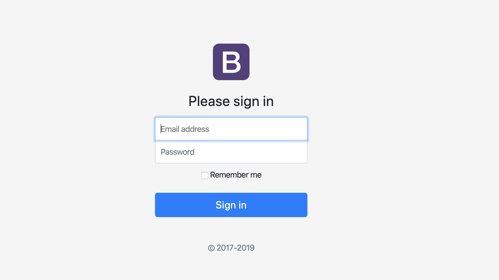

# 期货交易员网站开发——需求分析

[toc]

## 一、引言

### 1.1. 背景

要开发一个名称为《期货交易员》的网站。该项目的提出者是专业的期货交易从业人员。该网站将为期货投资者提供有用的信息，也将作为经营的门户网站。

### 1.2. 参考资料

该网站的开发主要参考：[《818期货学习网》](http://www.818qihuo.com/)，也将参考其他门户网站。

### 1.3. 假定和约束

希望该网站能够尽快上线，该网站主要提供信息咨询或者作为门户网站。

### 1.4. 用户的特点

使用该网站有：运营者、期货投资或交易者

第一类网站使用者：运营者

登陆网站，管理网站上的咨询。

第二类网站使用者：期货投资或交易者

期货投资或交易者，通过该网站浏览有用的信息，帮助其分析和决策。

## 二、 功能需求

### 2.1. 系统范围

用户希望能开发出一个类似《818期货学习网》的网站，网站的页面拥有和其类似的布局。

### 2.2. 系统体系结构

该系统分为两部分：后台管理、主页面。

### 2.3. 系统总体流程

用户登陆从后台登陆，能够对主页面上的文章进行管理：

用户——》登陆——〉发布文章（上传或手动填写咨询的正文内容）、删除文章、更新文章、预览文章；

客户——》点击到主页——〉查看文章

### 2.4. 需求分析

#### 2.4.1. 登陆后台

##### （1）功能描述

用户通过链接跳转到登陆页面，登陆成功才能进入后台管理页面。

##### （2）业务建模

以邮箱作为用户名；密码的长度至少6位，由英文或数字组成。

##### （3） 用户界面

类似下面的登陆界面

#### 2.4.2. 栏目管理

##### （1） 功能描述

栏目是对文章的分类，每个栏目对应着网站上的不同区域。

用户从后台登陆之后，能够对栏目进行管理（修改、添加、删除、查看）。

正常情况下，栏目是固定的，不需要经常进行增删改操作。

##### （2）业务建模

每个栏目对应页面上一个区域。

##### （3）用户界面

（还在设计中）

#### 2.4.3 文章管理

##### （1）功能描述

用户从后台登陆之后，能够对不同栏目的文章进行管理：添加文章、删除文章、修改文章、预览文章。

- 添加文章

  可以上传或手工编写的方式。

- 删除文章

  删除栏目下的文章。

- 修改文章

  重新上传或者重新编写文章。

- 预览文章

  能够看到带样式的文章内容。

##### （2）业务建模

（无）

##### （3）用户界面

（还在设计中）

#### 2.4.4 主页面

##### （1）功能描述

客户登陆到主页面，能够看到布局美好的页面。通过点击首页上的不同区域文章来阅读资讯。

##### （2）业务建模

（无）

##### （2）用户界面

（还在设计中）

## 三、 非功能需求

### 3.1. 性能要求

#### 3.1.1. 精度

能够更新文章，并对文章按照一定对规则进行排序。

### 3.1.2. 时间特性要求

因为是轻量级的，所以希望在访问页面的时候，能够尽可能的响应得快。

#### 3.1.3. 输人输出要求

添加文章的时候，正文为带有标签的文本内容；文章展示的时候，应该展示格式良好的内容。

### 3.2. 数据管理能力要求

最好对网站的访问做日志记录。

### 3.3. 安全保密性要求

后台的登陆，除了运营人员外，不开放其他人的访问。

### 3.4. 灵活性要求

电脑版和手机版访问应当有所不同，能够根据不同的设备显示不同的效果。

### 3.5. 其他专门要求

暂时没有其他专门要求～

## 四、 运行环境规定 

### 4.1. 设备

centos-2GB-bj-4723

### 4.2. 支持软件

通过电脑浏览器或手机浏览器访问

### 4.3. 接口[可选]

> 说明该软件同其他软件之间的接口、数据通信协议等。

无

## 五、 需求跟踪

还在完善～

